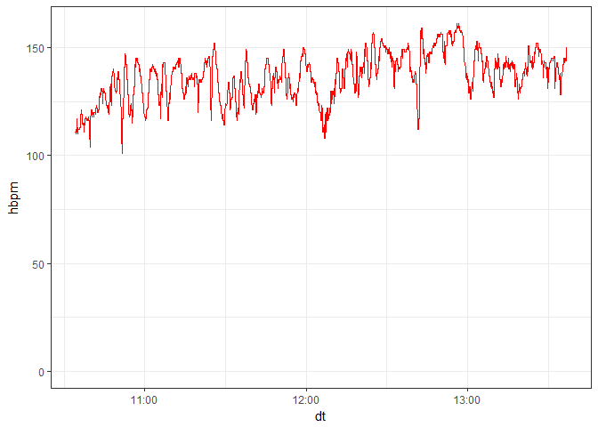
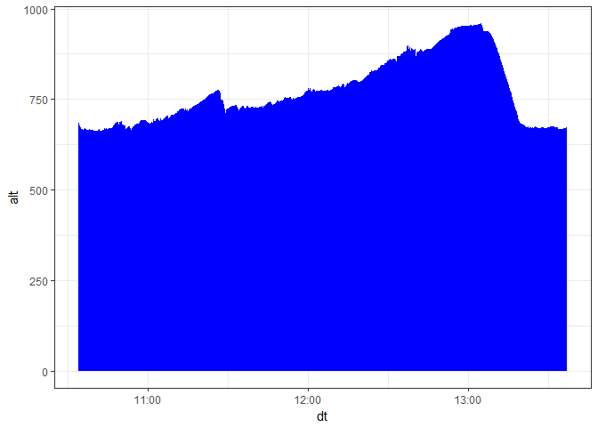

In this [RNotebook](http://rmarkdown.rstudio.com/r_notebooks.html) we'll read a [TCX](https://en.wikipedia.org/wiki/Training_Center_XML) and [GPX](https://en.wikipedia.org/wiki/GPS_Exchange_Format) files, used to track phisical training and exercises envolving GPS and paths used by some workout Mobile Apps and Devices.

## Tracking Files

There are two popular file format to track workouts and routes through GPS devices: GPX and TCX.

**GPX** is an [XML](https://en.wikipedia.org/wiki/XML) format designed specifically for saving GPS track, waypoint and route data. It is increasingly used by GPS programs because of its flexibility as an xml schema. More information can be found on the official [GPX website](http://www.topografix.com).

The **TCX** format is also an [XML](https://en.wikipedia.org/wiki/XML) format, but was created by [Garmin](http://www.garmin.com) to include additional data with each track point (e.g. heart rate and cadence) as well as a user defined organizational structure. The format appears to be primarily used by Garmin's fitness oriented GPS devices. The TCX schema is hosted by [Garmin](http://www.garmin.com).[^1]

Many of the dozens of other formats can be converted into GPX or TCX formats using [GPSBabel](http://www.gpsbabel.org).

## Reading a TCX File

Lets see what is the basic format of one [TCX file](https://en.wikipedia.org/wiki/Training_Center_XML), once it's a [XML file](https://en.wikipedia.org/wiki/XML) we just open it in a text editor to look at. I downloaded one from a MTB ride that I did using a [FitBit Charge 2](https://www.fitbit.com/charge2), plus an iPhone as tracker.

```xml

<?xml version="1.0" encoding="UTF-8" standalone="yes"?>
<TrainingCenterDatabase xmlns="http://www.garmin.com/xmlschemas/TrainingCenterDatabase/v2">
    <Activities>
        <Activity Sport="Biking">
            <Id>2018-01-13T08:15:42.000-02:00</Id>
            <Lap StartTime="2018-01-13T08:15:42.000-02:00">
                <TotalTimeSeconds>12672.0</TotalTimeSeconds>
                <DistanceMeters>42274.04000000001</DistanceMeters>
                <Calories>2315</Calories>
                <Intensity>Active</Intensity>
                <TriggerMethod>Manual</TriggerMethod>
                <Track>
                    <Trackpoint>
                        <Time>2018-01-13T08:15:42.000-02:00</Time>
                        <Position>
                            <LatitudeDegrees>-22.703736066818237</LatitudeDegrees>
                            <LongitudeDegrees>-46.75607788562775</LongitudeDegrees>
                        </Position>
                        <AltitudeMeters>684.7</AltitudeMeters>
                        <DistanceMeters>0.0</DistanceMeters>
                        <HeartRateBpm>
                            <Value>104</Value>
                        </HeartRateBpm>
                    </Trackpoint>
                    <Trackpoint>
                        <Time>2018-01-13T08:15:47.000-02:00</Time>
                        <Position>
                            <LatitudeDegrees>-22.703736066818237</LatitudeDegrees>
                            <LongitudeDegrees>-46.75607788562775</LongitudeDegrees>
                        </Position>
                        <AltitudeMeters>684.7</AltitudeMeters>
                        <DistanceMeters>6.240000000000001</DistanceMeters>
                        <HeartRateBpm>
                            <Value>102</Value>
                        </HeartRateBpm>
                    </Trackpoint>
                    
                    ...
                    
            </Lap>
            <Creator xsi:type="Device_t" xmlns:xsi="http://www.w3.org/2001/XMLSchema-instance">
                <Name>Fitbit Charge 2</Name>
                <UnitId>0</UnitId>
                <ProductID>0</ProductID>
            </Creator>
        </Activity>
    </Activities>
</TrainingCenterDatabase>

```
As we see, it's a time-date indexed XML file with some structuring to define `activities` and inside them `activity` with _summary informagtions_, `laps` and `track points`. 

Let's extract the available tracking data (date-time, lattitude and longitude coords, altitude and heart beat) from this file, using the [XML Package](https://cran.r-project.org/web/packages/XML/index.html). Because with are just interested in the GPS data we can use [XPath Query](https://www.w3schools.com/xml/xpath_intro.asp) directly to take the track points data through all the XML file. 


```r
# setup
library(XML)
library(lubridate)
library(tidyverse)

# Reading the XML file
file <- htmlTreeParse(file = "11654237848.tcx", # file downloaded from FitBit
                       error = function (...) {},
                       useInternalNodes = TRUE)

# XML nodes names to read 
features <- c("time", "position/latitudedegrees", "position/longitudedegrees",
              "altitudemeters", "distancemeters", "heartratebpm/value")

# building the XPath query adding the "father node"
xpath_feats <- paste0("//trackpoint/", features)

# for each of the XPaths let's extract the value of the node
xpath_feats %>%
  # the map returns a list with vector of the values for each xpath
  map(function(p){xpathSApply(file, path = p, xmlValue)}) %>%
  # setting a shorter name for them and collapsing the list in to a tibble
  setNames(c("dt", "lat", "lon", "alt", "dist", "hbpm")) %>%
  as_data_frame() %>% 
  # Lets correct the data type because everthing return as char
  mutate_at(vars(lat:dist), as.numeric) %>% # numeric values
  mutate(
    dt = lubridate::as_datetime(dt), # date time
    hbpm  = as.integer(hbpm), # integer (heart beat per minutes)
    # we'll build other two features:  
    tm.prev.s = c(0, diff(dt)), # time (s) from previous track point
    tm.cum.min  = round(cumsum(tm.prev.s)/60,1) # cumulative time (min)
  ) -> track

# lets see the final format
print(track)
```

```
## # A tibble: 10,950 x 8
##    dt                    lat   lon   alt   dist  hbpm tm.prev.s tm.cum.min
##    <dttm>              <dbl> <dbl> <dbl>  <dbl> <int>     <dbl>      <dbl>
##  1 2018-01-06 10:34:08 -22.7 -46.8   684 0        111      0         0    
##  2 2018-01-06 10:34:12 -22.7 -46.8   684 0.0200   111      4.00      0.100
##  3 2018-01-06 10:34:13 -22.7 -46.8   683 0.0500   111      1.00      0.100
##  4 2018-01-06 10:34:14 -22.7 -46.8   684 0.110    111      1.00      0.100
##  5 2018-01-06 10:34:15 -22.7 -46.8   684 0.790    111      1.00      0.100
##  6 2018-01-06 10:34:16 -22.7 -46.8   684 2.37     111      1.00      0.100
##  7 2018-01-06 10:34:17 -22.7 -46.8   685 4.08     111      1.00      0.200
##  8 2018-01-06 10:34:18 -22.7 -46.8   685 5.94     110      1.00      0.200
##  9 2018-01-06 10:34:19 -22.7 -46.8   686 7.83     110      1.00      0.200
## 10 2018-01-06 10:34:20 -22.7 -46.8   685 9.80     110      1.00      0.200
## # ... with 10,940 more rows
```


With the dataset in hand, we can use the info, for exemplo to plot the _heart beat_ and _altitude_.


```r
library(ggplot2)

ggplot(track, aes(x=dt, y=hbpm)) + 
  geom_line(colour="red") + theme_bw() + ylim(0,max(track$hbpm))
```

<!-- -->


```r
ggplot(track) +
  geom_area(aes(x = dt, y = alt), fill="blue", stat="identity") +
  theme_bw() 
```

<!-- -->

## Reading a GPX file

Basically, as we using XPath to get the datapoints, reading a GPX file is pretty the same, let's look the structure of one file exported from [Runtastic website](http://www.runtastic.com)

```xml

<?xml version="1.0" encoding="UTF-8"?>
<gpx version="1.1" creator="Runtastic: Life is short - live long, http://www.runtastic.com" xsi:schemaLocation="http://www.topografix.com/GPX/1/1
                                http://www.topografix.com/GPX/1/1/gpx.xsd
                                http://www.garmin.com/xmlschemas/GpxExtensions/v3
                                http://www.garmin.com/xmlschemas/GpxExtensionsv3.xsd
                                http://www.garmin.com/xmlschemas/TrackPointExtension/v1
                                http://www.garmin.com/xmlschemas/TrackPointExtensionv1.xsd" xmlns="http://www.topografix.com/GPX/1/1" xmlns:gpxtpx="http://www.garmin.com/xmlschemas/TrackPointExtension/v1" xmlns:gpxx="http://www.garmin.com/xmlschemas/GpxExtensions/v3" xmlns:xsi="http://www.w3.org/2001/XMLSchema-instance">
  <metadata>
    <desc>Ate o Barracão de Itapira. Volta pelo Jardim Vitoria atras do Cristo e Faz. Palmeiras.</desc>
    <copyright author="www.runtastic.com">
      <year>2017</year>
      <license>http://www.runtastic.com</license>
    </copyright>
    <link href="http://www.runtastic.com">
      <text>runtastic</text>
    </link>
    <time>2017-06-11T11:45:00.000Z</time>
  </metadata>
  <trk>
    <link href="http://www.runtastic.com/sport-sessions/1698893337">
      <text>Visit this link to view this activity on runtastic.com</text>
    </link>
    <trkseg>
      <trkpt lon="-46.7560615539550781" lat="-22.7035655975341797">
        <ele>677.462890625</ele>
        <time>2017-06-11T11:45:00.000Z</time>
      </trkpt>
      <trkpt lon="-46.7560310363769531" lat="-22.7035102844238281">
        <ele>677.3987426757812</ele>
        <time>2017-06-11T11:45:02.000Z</time>
      </trkpt>
      
      ...
      
      </trkseg>
  </trk>
</gpx>

```

Basically same metadata in the beginning and the `track points` are in the nodes `trkpt` but the struct is different, the GPS coords are `attributes` of these nodes while `elevation` and `time` are sub-nodes in the value. We'll have to use XPaths differents to get the value and the attributes.


```r
# reading the xml file download from runtastic
file <- htmlTreeParse(file = "runtastic_20170611_1134_Cycling.gpx",
                      error = function (...) {},
                      useInternalNodes = TRUE)

# reading the ATTRIBUTES of 'trkpt' nodes
coords <- xpathSApply(file, path = "//trkpt", xmlAttrs) # <- look parameter xmlAttrs
lat <- as.numeric(coords["lat", ])
lon <- as.numeric(coords["lon", ])

# reading node values
ele <- as.numeric(xpathSApply(file, path = "//trkpt/ele", xmlValue)) # <- look parameter xmlValue
dt <- lubridate::as_datetime(xpathSApply(file, path = "//trkpt/time", xmlValue)) # <- look parameter xmlValue

# buiding the data frame
data_frame(
  dt = dt,
  lat = lat,
  lon = lon, 
  alt = ele
) %>% mutate(
  tm.prev.s = c(0, diff(dt)), # time (s) from previous track point
  tm.cum.min  = round(cumsum(tm.prev.s)/60,1) # cumulative time (min)
) -> track

print(track)
```

```
## # A tibble: 3,625 x 6
##    dt                    lat   lon   alt tm.prev.s tm.cum.min
##    <dttm>              <dbl> <dbl> <dbl>     <dbl>      <dbl>
##  1 2017-06-11 11:45:00 -22.7 -46.8   677      0         0    
##  2 2017-06-11 11:45:02 -22.7 -46.8   677      2.00      0    
##  3 2017-06-11 11:45:05 -22.7 -46.8   677      3.00      0.100
##  4 2017-06-11 11:45:08 -22.7 -46.8   677      3.00      0.100
##  5 2017-06-11 11:45:10 -22.7 -46.8   677      2.00      0.200
##  6 2017-06-11 11:45:13 -22.7 -46.8   677      3.00      0.200
##  7 2017-06-11 11:45:16 -22.7 -46.8   676      3.00      0.300
##  8 2017-06-11 11:45:18 -22.7 -46.8   676      2.00      0.300
##  9 2017-06-11 11:45:21 -22.7 -46.8   675      3.00      0.400
## 10 2017-06-11 11:45:24 -22.7 -46.8   674      3.00      0.400
## # ... with 3,615 more rows
```


## Conclusion

As we saw, it's pretty straightforward to get the dada in the XML and transform them in a useful R data frame. Obviously if the XML was more complicated, with several activities and laps, we should handle this info if we want keep these informations before read the `trackpoints`. The dataframe with track points would gain `activity.id` and `lap.id` columns.

## References

[^1]: http://www.earlyinnovations.com/gpsphotolinker/about-gpx-and-tcx-file-formats.html
